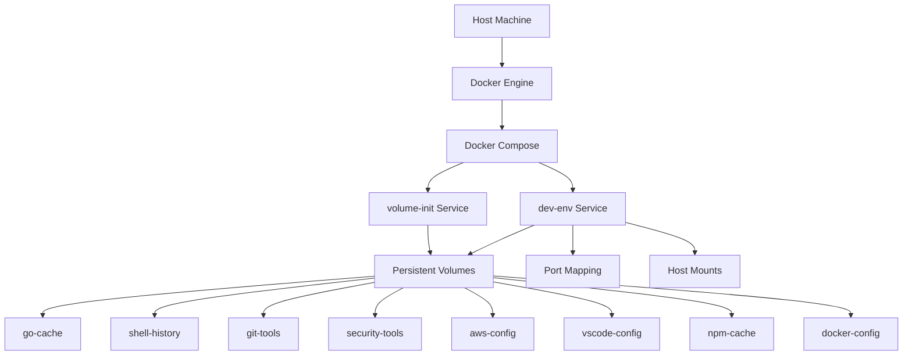

# System Architecture Documentation

This document provides a comprehensive overview of the dotfiles development environment architecture for AI agents responsible for system-level maintenance and optimization.

## 🏗️ High-Level Architecture



## 🐳 Container Architecture

### Base System Layer
- **Image**: `manjarolinux/base:latest` (uses latest for automatic security updates)
- **User**: `dev` (UID: 1001, GID: 1001)
- **Init System**: Enabled for proper signal handling
- **Security**: `no-new-privileges:true`, restricted sudo access

### Multi-Stage Build Process

#### Stage 1: base-system
```dockerfile
FROM manjarolinux/base:latest AS base-system
```
- System package installation
- User creation and sudo configuration
- Base development tools setup

#### Stage 2: tools
```dockerfile  
FROM base-system AS tools
```
- AUR tools installation (tfenv, aws-cli-bin, k9s, oh-my-zsh-git)
- Pacman tools installation (ripgrep, fd, bat, go, nodejs, kubectl, helm)
- Go development tools (gopls, delve)
- Zsh plugins setup

#### Stage 3: final
```dockerfile
FROM tools AS final
```
- Directory structure setup
- SSH daemon configuration
- Final permissions and startup script

## 📦 Volume Architecture

### Volume Initialization Service
```yaml
volume-init:
  image: manjarolinux/base:latest
  command: ["sh", "/init-volumes.sh"]
```

**Purpose**: Pre-populate Docker volumes with correct directory structures and permissions before the main development container starts.

### Volume Mapping Strategy

| Volume | Container Path | Purpose |
|--------|---------------|---------|
| `security-tools` | `/home/dev/.security` | SSH keys, GPG keys, host keys |
| `go-cache` | `/home/dev/.go-cache` | Go module cache, build artifacts |
| `shell-history` | `/home/dev/.shell_history` | Bash, zsh, tmux command history |
| `git-tools` | `/home/dev/.git_tools` | Git credentials, config, GitHub CLI |
| `aws-config` | `/home/dev/.aws` | AWS CLI configuration and credentials |
| `vscode-config` | `/home/dev/.vscode` | VS Code extensions and settings |
| `npm-cache` | `/home/dev/.npm` | npm package cache |
| `docker-config` | `/home/dev/.docker` | Docker CLI configuration |

### Host Mounts
```yaml
volumes:
  - ./workspace:/workspace                    # Project files
  - ./configs/.vimrc:/home/dev/.vimrc:ro     # Read-only configs
  - ./configs/.zshrc:/home/dev/.zshrc:ro
  - ./configs/.tmux.conf:/home/dev/.tmux.conf:ro
  - /var/run/docker.sock:/var/run/docker.sock # Docker-in-Docker
```

## 🌐 Network Architecture

### Bridge Network Configuration
```yaml
networks:
  dev-network:
    driver: bridge
    ipam:
      config:
        - subnet: 172.20.0.0/16
```

### Port Mapping
- `2222:2222` - SSH server for VS Code Remote-SSH
- `8080:8080` - General web development
- `3000:3000` - Node.js applications  
- `9000:9000` - Additional services

## 🔐 Security Architecture

### User Security Model
- **Non-root execution**: Container runs as `dev` user
- **Sudo access**: Passwordless sudo for development tasks
- **Group memberships**: Docker group for container access

### SSH Security
**Configuration** (`configs/linux/etc/ssh/sshd_config`):
- **Custom port**: 2222 instead of standard 22
- **Host keys**: Persistent storage in `/home/dev/.security/ssh-host-keys/`
- **Authentication**: `AuthorizedKeysFile .ssh/authorized_keys`
- **Security**: `PermitRootLogin no`, `PermitEmptyPasswords no`
- **User restrictions**: `AllowUsers dev` only
- **Logging**: `SyslogFacility AUTH`, `LogLevel INFO`

### File Permissions
```bash
# Security-sensitive directories
chmod 700 /home/dev/.security
chmod 600 /home/dev/.security/ssh/*
chmod 700 /home/dev/.security/ssh-host-keys

# Development directories  
chmod 755 /home/dev/.go-cache
chmod 755 /home/dev/.git_tools
chmod 644 /home/dev/.shell_history/*
```

## ⚙️ Service Dependencies

### Dependency Chain
```
volume-init (must complete) → dev-env (starts)
```

### Health Checks
```yaml
healthcheck:
  test: ["CMD", "pgrep", "sshd"]
  interval: 30s
  timeout: 10s
  start_period: 5s
  retries: 3
```

## 🔧 Configuration Management

### Environment Variables
```bash
# Build optimization (set in Makefile during build)
DOCKER_BUILDKIT=1
BUILDKIT_PROGRESS=plain

# User configuration
DEV_USER_ID=1001
DEV_GROUP_ID=1001

# Development environment
MAKEFLAGS=-j$(nproc)
NODE_OPTIONS="--max-old-space-size=4096"
```

### Build Context
- **Context root**: Repository root directory
- **Dockerfile**: Single multi-stage Dockerfile
- **Build args**: Dynamic build date, user IDs

## 🚀 Performance Optimizations

### Build Caching
```dockerfile
RUN --mount=type=cache,target=/var/cache/pacman/pkg
RUN --mount=type=cache,target=/home/dev/.cache/yay,uid=1001,gid=1001
RUN --mount=type=cache,target=/home/dev/.cache/makepkg,uid=1001,gid=1001
RUN --mount=type=cache,target=/home/dev/go,uid=1001,gid=1001
RUN --mount=type=cache,target=/home/dev/.npm,uid=1001,gid=1001
```

### Build Process
- **Parallel execution**: `ENV MAKEFLAGS=-j$(nproc)`
- **Parallel builds**: `docker-compose build --parallel`
- **BuildKit caching**: Aggressive layer caching for faster rebuilds
- **Error handling**: Build failure detection and reporting

### Security Configuration
```yaml
security_opt:
  - no-new-privileges:true
tmpfs:
  - /tmp:noexec,nosuid,nodev,size=100m
  - /run:noexec,nosuid,nodev,size=100m
```

### System-Level Performance & Security Tuning
**Kernel Parameters** (`configs/linux/etc/sysctl.d/99-optimized.conf`):
- **VM Management**: `vm.swappiness=10`, `vm.dirty_ratio=15`, `vm.max_map_count=262144`
- **Network Performance**: `net.core.somaxconn=65535`, optimized TCP/UDP buffers
- **Filesystem**: `fs.inotify.max_user_watches=524288` for development file watching

**Process Limits** (`configs/linux/etc/security/limits.d/99-container.conf`):
- File descriptors: 65536 (soft/hard)
- Processes: 32768 (soft/hard)
- Stack size: 8192KB (soft), 32768KB (hard)
- Core dumps: disabled for security

## 🔄 Startup Sequence

1. **Volume Initialization**
   - `init-volumes.sh` creates directory structures
   - Sets proper ownership and permissions
   - Prepares SSH key infrastructure

2. **Main Container Start**
   - `setup-directories.sh` creates symlinks
   - Sets up Docker permissions
   - Configures development environment

3. **SSH Daemon Start**
   - `start-sshd.sh` generates/loads host keys
   - Starts SSH daemon on port 2222
   - Enables VS Code Remote-SSH access

## 📊 Monitoring & Observability

### Container Status
```bash
# Check container health
docker-compose ps

# View logs
docker-compose logs -f

# Monitor resource usage
docker stats dev-environment
```

### Volume Status
```bash
# List volumes
docker volume ls | grep dotfiles

# Inspect volume
docker volume inspect dotfiles_go-cache
```

## 🔧 Maintenance Considerations

### Image Updates
- Base image updates require full rebuild
- Multi-stage caching reduces rebuild time
- Volume data persists across rebuilds

### Volume Management
- Backup strategy for persistent data
- Volume cleanup for disk space management
- Migration procedures for volume updates

### Security Updates
- Regular base image security patches
- SSH configuration reviews
- Permission audits

---

*This architecture documentation is maintained by AI agents. For operational procedures, see `maintenance.md`.*